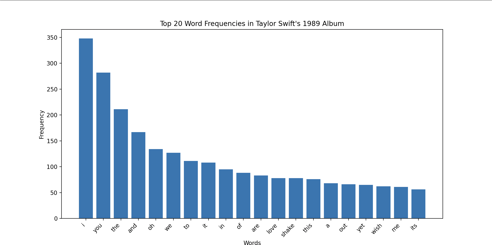

## Taylor Swift Lyrics

Steps to run:

```bash
python3 lyrics.py
```

Output:

```
Most likely word after 'wildest': dreams
Most likely word after 'shake': it

Generated 5 different sentences starting with 'you':
1. you would wait the woods yet are in the crowds
2. you come back every time not like all through a
3. you breathless mm if its so its been easy all
4. you made a new baby im lightnin on on my
5. you turn right at the good i was black and
```

It also plots the graph of Words and their corresponding frequencies.

